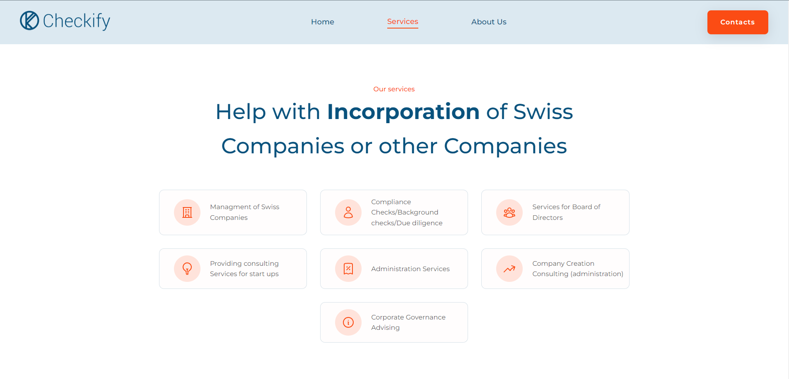

# Checkify AG: Swiss Productivity Management Website

You can see the website here: [Website Link](https://checkify.ch/)

## Project Description
The website serves as an information hub for potential clients, showcasing the platform's features, benefits, and solutions tailored for businesses seeking efficiency and streamlined operations.

---

## Features
- **Service Overview**: Provides detailed descriptions of Checkify's offerings.
- **Client Testimonials**: Highlights feedback from satisfied users.
- **Contact and Support**: Easy-to-use forms for inquiries and support requests.
- **Modern Design**: A clean and professional layout representing the brand's ethos.
- **Responsive Design**: Fully optimized for desktop, tablet, and mobile devices.

---

## Technologies Used
- **HTML5**: For structuring the content.
- **CSS3**: For modern styling and responsive layouts.
- **JavaScript**: For interactive elements and enhanced user experience.
- **Backend Framework**: PhP / Cyon.ch.
- **Database**: MySql.

---

## Setup Instructions
To run this project locally, follow these steps:

1. Clone the repository (if available):

   ```bash
   git clone https://github.com/AndNijaz/Checkify-AG.git
   ```

2. Navigate to the project directory:

   ```bash
   cd Checkify-AG
   ```

3. Install dependencies (if applicable):

   ```bash
   npm install
   ```

4. Start the development server (if applicable):

   ```bash
   npm start
   ```

5. Open `http://localhost:3000` in your browser to view the project.

---

## Usage
The website is designed for:
- **Businesses**: Exploring Checkify's productivity solutions.
- **Clients**: Learning about features and benefits tailored to organizational needs.
- **Prospective Users**: Contacting the team for more information or onboarding.

---

## Screenshots

### Homepage


### Features Section


> *Screenshots are stored in the `/img` directory.*

---

## Project Status
This project is **live and operational**. Future enhancements may include:
- Expanding multilingual support for international clients.
- Adding video tutorials and product demos.
- Integrating customer portals for personalized experiences.

---

## Acknowledgements
Special thanks to the Checkify AG team for their vision and collaboration in developing this platform. This project is a testament to the company's dedication to efficiency and innovation.

---

